# Hướng dẫn sử dụng — FSC Exam Platform

Hệ thống khảo thí & học tập của FSchools: ngân hàng câu hỏi, tổ chức ca thi, giao bài tập về nhà, học liệu, chấm bài và báo cáo.

> 💡 **Hướng dẫn ngay trong ứng dụng:** ở thanh trên cùng mỗi trang có nút **“Hướng dẫn”** (biểu tượng ❓). Bấm vào để xem hướng dẫn kèm ảnh cho đúng chức năng đang mở — không cần rời màn hình làm việc.
>
> 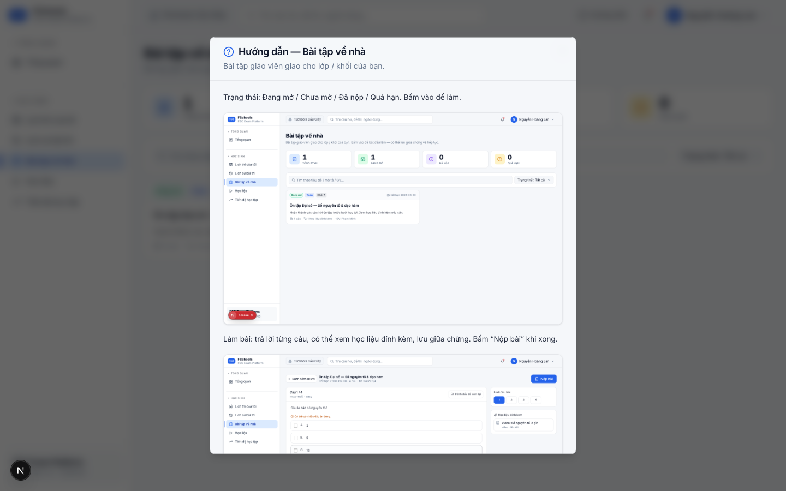

> Phiên bản tài liệu: 2026.06 · Áp dụng cho FSC Exam Platform v1.0
>
> 📷 Ảnh minh hoạ trong tài liệu dùng **dữ liệu demo mẫu** (không phải dữ liệu thật của trường).

---

## Mục lục

1. [Khái niệm & vai trò](#1-khái-niệm--vai-trò)
2. [Đăng nhập](#2-đăng-nhập)
3. [Dành cho Học sinh](#3-dành-cho-học-sinh)
4. [Dành cho Giáo viên](#4-dành-cho-giáo-viên)
5. [Quy trình tạo đề & thi (chi tiết)](#5-quy-trình-tạo-đề--thi-chi-tiết)
6. [Bài tập về nhà (BTVN)](#6-bài-tập-về-nhà-btvn)
7. [Dành cho Quản trị campus](#7-dành-cho-quản-trị-campus)
8. [Dành cho Superadmin](#8-dành-cho-superadmin)
9. [Câu hỏi thường gặp](#9-câu-hỏi-thường-gặp)

---

## 1. Khái niệm & vai trò

Hệ thống tổ chức theo **campus** (cơ sở). Mỗi người dùng thuộc một campus và có một **vai trò** quyết định menu nhìn thấy:

| Vai trò | Phạm vi chính |
|---|---|
| **Học sinh** (student) | Làm bài thi, làm BTVN, xem học liệu, theo dõi tiến độ của bản thân |
| **Giáo viên** (teacher) | Soạn câu hỏi, giao BTVN, giám thị ca thi, chấm tự luận, xem báo cáo |
| **Trưởng bộ môn** (subject-lead) | Như giáo viên + duyệt câu hỏi/đề, quản lý khung đề |
| **Quản trị campus** (campus-admin) | Toàn quyền trong campus: người dùng, khối/lớp, môn học, phê duyệt |
| **Giám đốc đào tạo** (academic-director) | Như quản trị campus, phạm vi đào tạo |
| **Superadmin** | Quản lý toàn hệ thống & các campus (không thao tác trực tiếp trong 1 campus) |

**Khái niệm cốt lõi:**

- **Câu hỏi** — đơn vị nhỏ nhất, thuộc một môn + khối, có 8 dạng (xem [mục 5](#5-quy-trình-tạo-đề--thi-chi-tiết)).
- **Khung đề (Blueprint)** — ma trận đề: mỗi chủ đề lấy bao nhiêu câu dễ/trung bình/khó.
- **Gói đề (Package)** — khung đề + cấu hình (thời lượng…), sau khi duyệt thì **sinh đề** thành nhiều mã đề.
- **Ca thi (Shift)** — buổi thi cụ thể: gắn gói đề, chọn lớp/học sinh, lịch, phòng, giám thị, chống gian lận.
- **Bài làm (Attempt)** — bài của một học sinh cho một ca thi / một BTVN.

---

## 2. Đăng nhập

1. Mở trang hệ thống → màn hình **Đăng nhập**.
2. Chọn đúng tab: **Học sinh** hoặc **Nhân viên**.
3. Nhập tài khoản:
   - **Học sinh:** mã học sinh (hoặc tên đăng nhập) + mật khẩu.
   - **Nhân viên:** email + mật khẩu.
4. Bấm **Đăng nhập**.


> Nếu đăng nhập sai tab (vd tài khoản học sinh ở tab nhân viên) hệ thống sẽ báo lỗi và đăng xuất lại. Quên mật khẩu: liên hệ quản trị campus để đặt lại.

---

## 3. Dành cho Học sinh

Menu của học sinh gồm 5 mục:

### Lịch thi của tôi (`Lịch thi của tôi`)
- Danh sách các ca thi được giao cho lớp/khối của bạn.
- Mặc định **ẩn các ca đã kết thúc** — bật bộ lọc để xem lại.
- Bấm vào ca **đang mở** để vào làm bài.

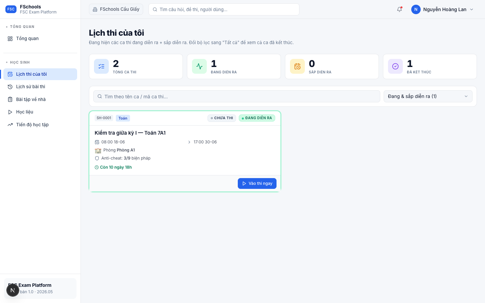

**Khi làm bài thi:**
- Bài có **đếm giờ**; hết giờ tự nộp.
- Trả lời từng câu, có thể **đánh dấu** câu để xem lại.
- Có thể **lưu giữa chừng** — đáp án được lưu tự động.
- Bấm **Nộp bài** khi xong. **Mỗi ca chỉ làm 1 lần.**
- Nếu giám thị gửi tin nhắn, tin sẽ hiện ngay trên màn hình thi.

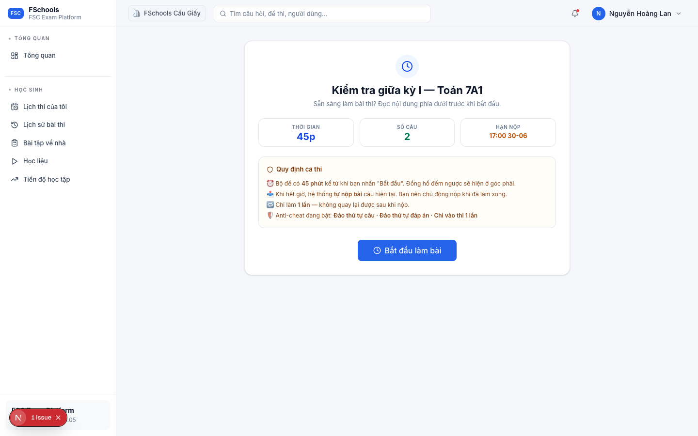

> Vào muộn: ca thi có thể giới hạn "thời gian vào muộn tối đa". Quá hạn đó mà chưa vào thì không vào được nữa — liên hệ giáo viên giám sát.

### Lịch sử bài thi (`Lịch sử bài thi`)
- Các bài đã nộp + điểm. Câu tự luận chờ chấm sẽ hiển thị trạng thái "chờ chấm".
- Bấm vào một bài để xem **kết quả chi tiết** (điểm, số câu đúng, đáp án từng câu).

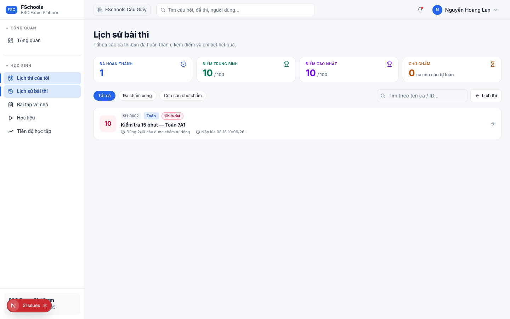

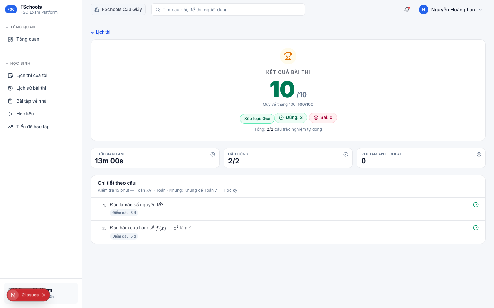

### Bài tập về nhà (`Bài tập về nhà`)
- BTVN giáo viên giao. Trạng thái: **Đang mở / Chưa mở / Đã nộp / Quá hạn**.
- Bấm vào để làm — **lưu giữa chừng** được, làm tiếp sau cũng được.
- Có thể đính kèm **học liệu** (tài liệu/video) để tham khảo khi làm.
- Nộp xong xem ngay số câu đúng (với câu trắc nghiệm/tự chấm).

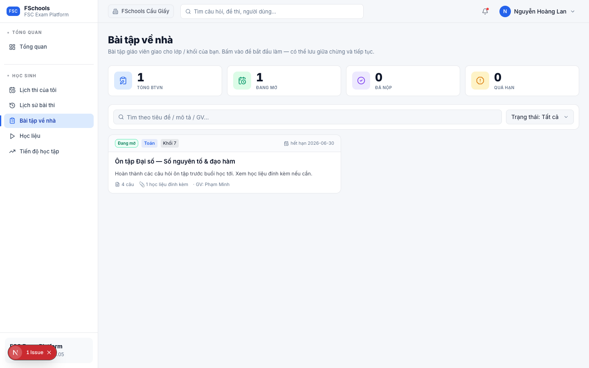

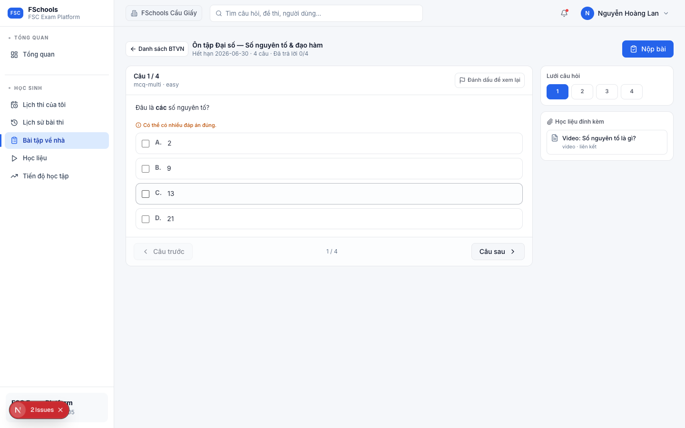

### Học liệu (`Học liệu`)
- Kho tài liệu/video giáo viên chia sẻ cho lớp/môn của bạn.

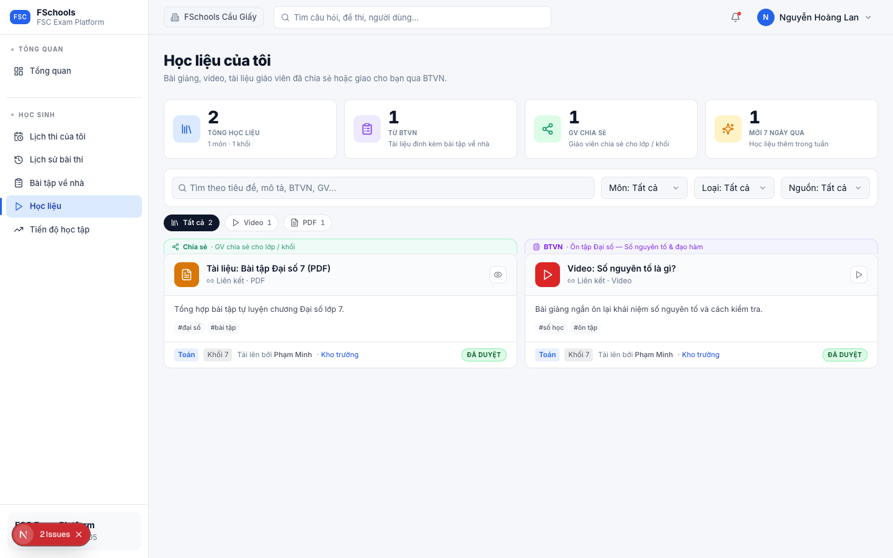

### Tiến độ học tập (`Tiến độ học tập`)
- Tổng hợp kết quả thi + BTVN của bạn theo thời gian.

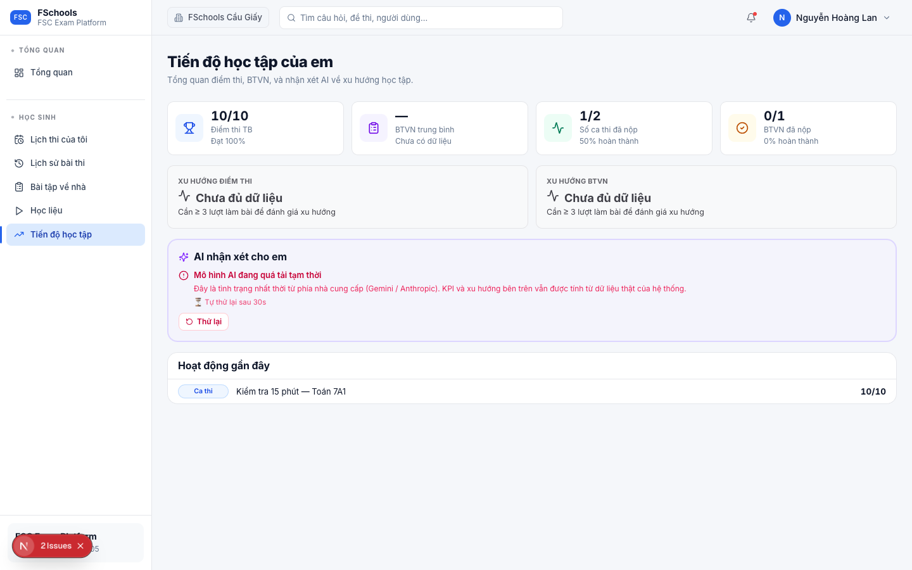

---

## 4. Dành cho Giáo viên

Giáo viên thấy 2 nhóm menu: **Của tôi** và **Vận hành**.

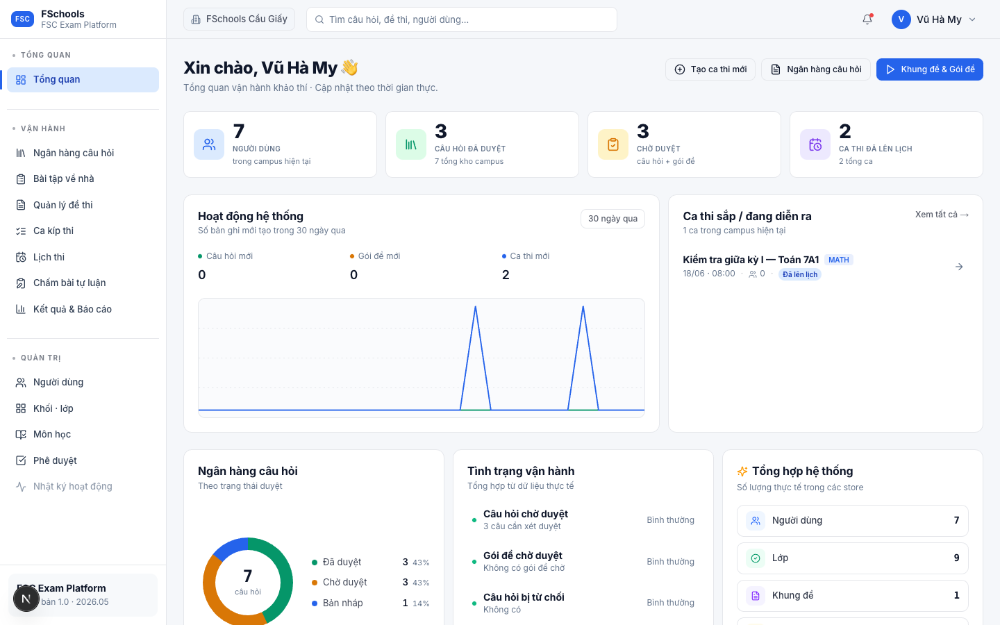

### Nhóm "Của tôi"
- **Lớp của tôi** — các lớp bạn phụ trách.
- **Môn của tôi** — các môn bạn dạy.
- **Giám sát thi** — theo dõi trực tiếp các ca thi bạn làm giám thị (xem học sinh đang làm, gửi nhắc nhở, ghi nhận vi phạm).

### Nhóm "Vận hành"
- **Ngân hàng câu hỏi** — soạn / import câu hỏi.
- **Bài tập về nhà** — tạo & giao BTVN.
- **Quản lý đề thi** — khung đề & gói đề (cần quyền tạo khung đề).
- **Ca kíp thi** — danh sách ca thi (tạo ca cần quyền tạo ca).
- **Lịch thi** — lịch tổng các ca.
- **Chấm bài tự luận** — chấm các câu tự luận theo rubric.
- **Kết quả & Báo cáo** — thống kê điểm, phổ điểm, xuất báo cáo.

> Một số quyền (tạo khung đề / tạo gói đề / tạo ca thi) do **quản trị campus cấp riêng** cho từng giáo viên. Nếu không thấy nút tạo, liên hệ quản trị để được cấp quyền.

### Soạn câu hỏi
1. Vào **Ngân hàng câu hỏi → Tạo câu hỏi**.
2. Chọn **dạng câu hỏi**, môn, khối, độ khó, nhập nội dung + đáp án.
3. Lưu — câu mới ở trạng thái **nháp/chờ duyệt** (tuỳ cấu hình kho).
   - **Kho cá nhân:** riêng bạn dùng.
   - **Kho campus:** dùng chung sau khi **Trưởng bộ môn duyệt**.

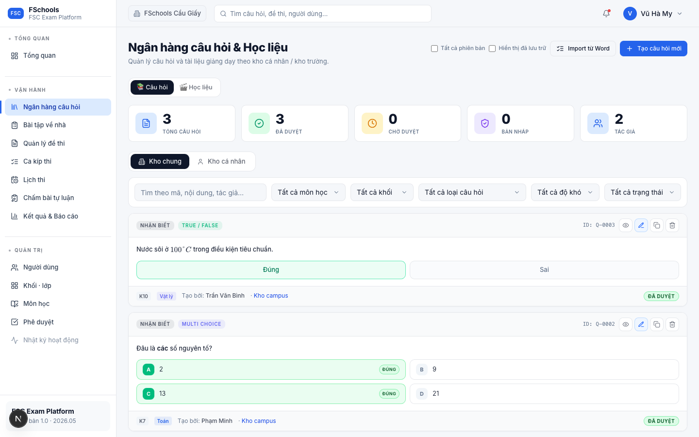

### Import câu hỏi từ Word
1. **Ngân hàng câu hỏi → Import từ Word**.
2. **Tải file mẫu (.docx)** — file có 14 câu ví dụ đủ 8 dạng.
3. Mở trong Word → sửa nội dung theo mẫu → lưu `.docx` → tải lên.
4. **Công thức toán:** gõ trực tiếp bằng **MathType** hoặc **Equation Editor** của Word (Insert → Equation). Công thức mẫu trong file đã soạn sẵn, click vào để sửa — **không cần gõ LaTeX**, hệ thống tự đọc.
5. **Ảnh:** dán trực tiếp vào Word, sẽ được kèm theo khi import.
6. **Đáp án đúng (trắc nghiệm):** đánh dấu `[đúng]` sau phương án.

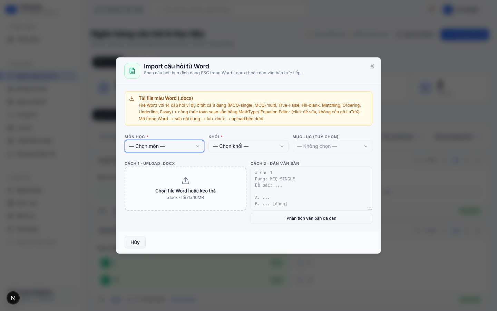

---

## 5. Quy trình tạo đề & thi (chi tiết)

Đây là luồng cốt lõi, theo đúng thứ tự:

```
Câu hỏi (đã duyệt)  →  Khung đề  →  Gói đề  →  SINH ĐỀ  →  Ca thi  →  Học sinh thi  →  Chấm  →  Báo cáo
```

### 8 dạng câu hỏi hỗ trợ
| Dạng | Mô tả |
|---|---|
| **MCQ-single** | Trắc nghiệm 1 đáp án đúng |
| **MCQ-multi** | Trắc nghiệm nhiều đáp án đúng |
| **True-False** | Đúng / Sai |
| **Fill-blank** | Điền vào chỗ trống (`___`) |
| **Matching** | Nối cặp |
| **Ordering** | Sắp xếp thứ tự |
| **Underline** | Gạch chân (đánh dấu `[...]`) |
| **Essay** | Tự luận (chấm tay theo rubric) |

### Bước 1 — Khung đề (Quản lý đề thi)
Tạo ma trận: với mỗi chủ đề, chọn số câu **dễ / trung bình / khó** và bộ câu hỏi nguồn.

### Bước 2 — Gói đề
Từ khung đề, tạo gói đề: đặt tên, thời lượng. Gói đề phải được **duyệt** (Phê duyệt → Gói đề) trước khi dùng.

### Bước 3 — ⚠️ Sinh đề (BẮT BUỘC)
Vào gói đề đã duyệt → **Sinh đề** để tạo các mã đề (Đề 001, 002…). Mỗi học sinh sẽ nhận một mã đề.

> **Quan trọng:** gói đề **chưa sinh đề** thì **không tạo được ca thi** từ nó. Ở bước chọn gói đề khi tạo ca, gói chưa sinh đề bị làm mờ và gắn nhãn **"Chưa sinh đề"**.

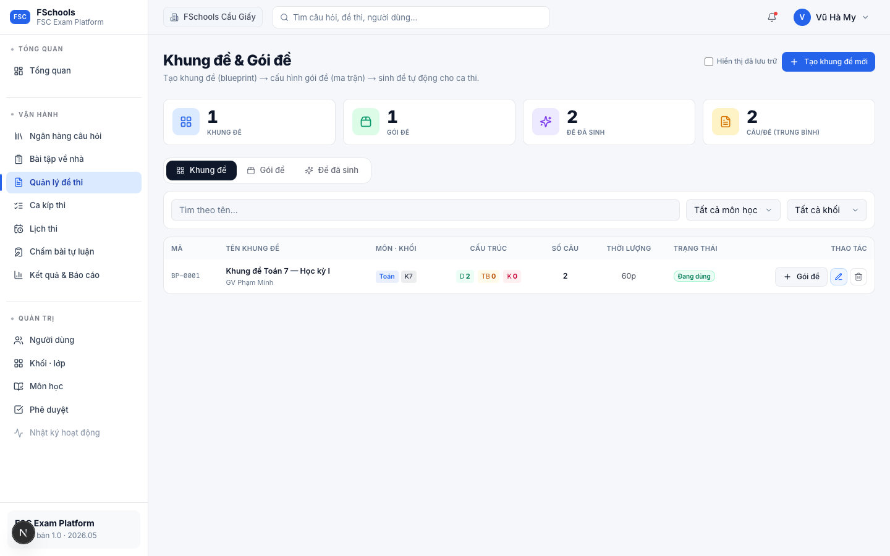

### Bước 4 — Tạo ca thi (Ca kíp thi → Tạo ca thi mới)
Wizard 5 bước:
1. **Đối tượng** — chọn khối / môn / lớp + danh sách học sinh dự thi.
2. **Gói đề & thang điểm** — chọn gói đề (đã sinh đề) + cấu hình điểm (đều / theo độ khó / thủ công).
3. **Lịch thi** — giờ mở, giờ đóng, cho phép vào muộn (phút).
4. **Phòng & giám thị** — chia phòng, gán học sinh, gán giám thị (mỗi phòng ≥ 1 giám thị).
5. **Chống gian lận** — cấu hình anti-cheat.

Lưu → ca thi ở trạng thái **đã lên lịch**; đề được "đóng băng" (snapshot) tại thời điểm này nên sửa câu hỏi sau đó **không** ảnh hưởng học sinh đang thi.

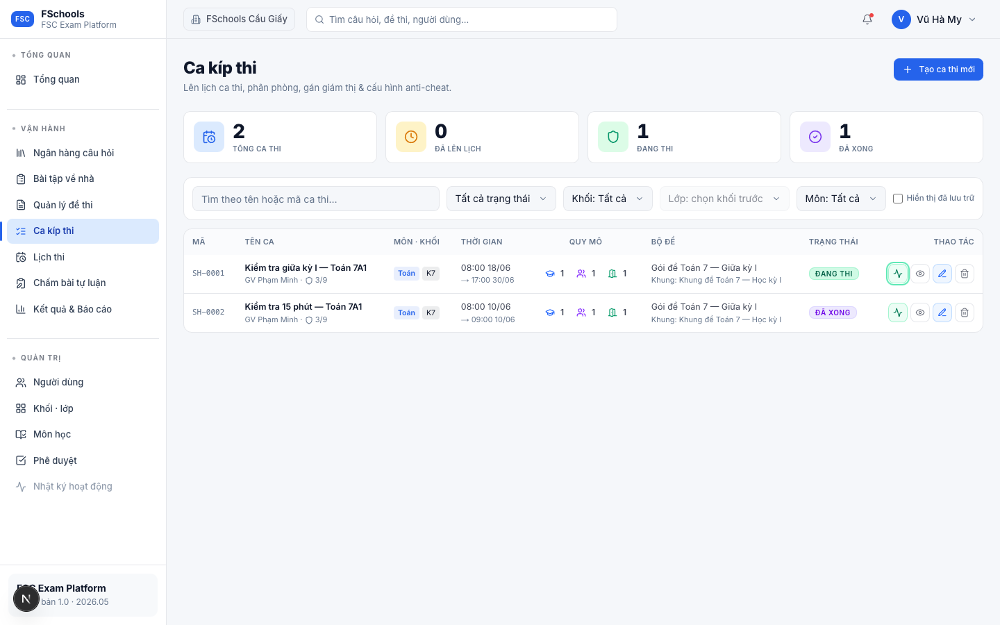

### Bước 5 — Giám sát & Chấm
- **Giám sát thi**: theo dõi trực tiếp, gửi nhắc nhở.
- Trắc nghiệm **chấm tự động**; tự luận vào **Chấm bài tự luận** chấm theo rubric.

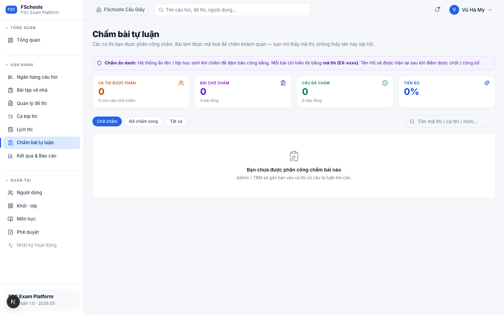

### Bước 6 — Báo cáo
**Kết quả & Báo cáo**: điểm từng học sinh, phổ điểm, thống kê theo ca/lớp.

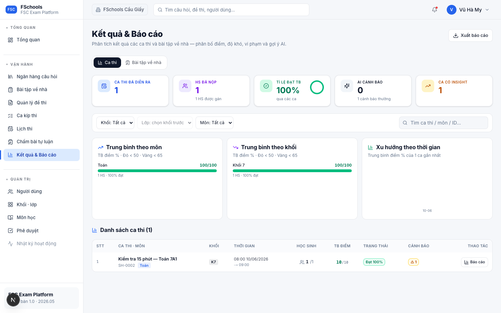

---

## 6. Bài tập về nhà (BTVN)

### Giáo viên giao BTVN
1. **Bài tập về nhà → Tạo BTVN**.
2. Chọn câu hỏi (từ ngân hàng), đính kèm **học liệu** (nếu cần).
3. Chọn **lớp** hoặc danh sách **học sinh** cụ thể.
4. Đặt **ngày giao** và **hạn nộp**.
5. Giao bài.

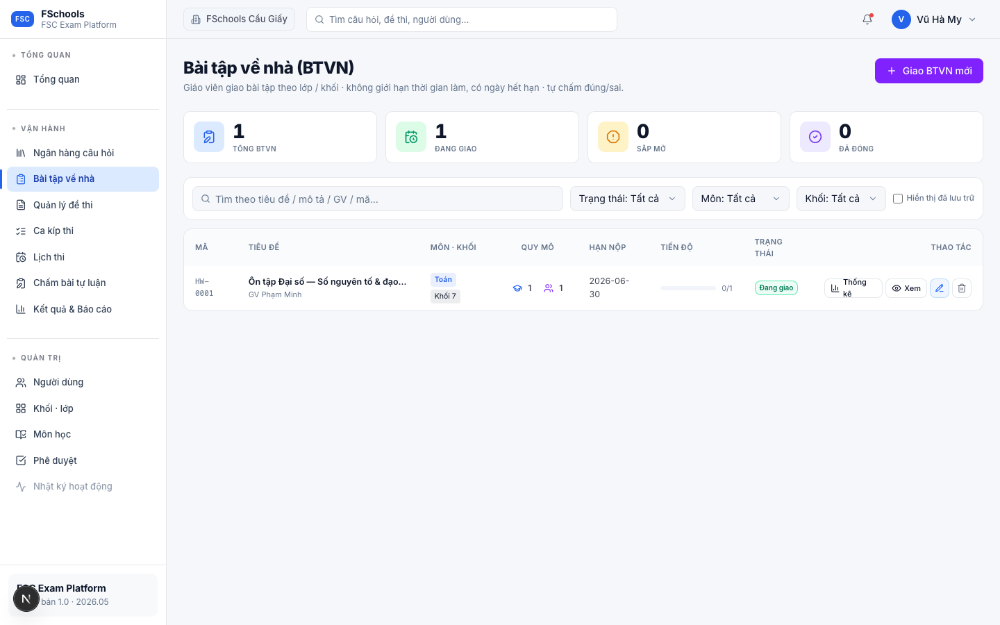

### Theo dõi
- Vào BTVN → **Thống kê** xem ai đã nộp, số câu đúng, tiến độ lớp.

> BTVN đã có học sinh làm thì **không xoá/lưu trữ** được (bảo toàn dữ liệu báo cáo).

### Học sinh làm BTVN
Xem [mục 3](#3-dành-cho-học-sinh) — vào **Bài tập về nhà**, làm, lưu giữa chừng, nộp.

---

## 7. Dành cho Quản trị campus

Nhóm **Quản trị** (campus-admin / academic-director):

- **Người dùng** — tạo/sửa tài khoản giáo viên & học sinh, **cấp quyền** (tạo khung đề / gói đề / ca thi cho từng giáo viên), đặt lại mật khẩu.
- **Khối · lớp** — quản lý khối, lớp và phân học sinh vào lớp.
- **Môn học** — danh mục môn của campus.
- **Phê duyệt** — duyệt câu hỏi / gói đề ở kho campus (Trưởng bộ môn cũng có quyền này).

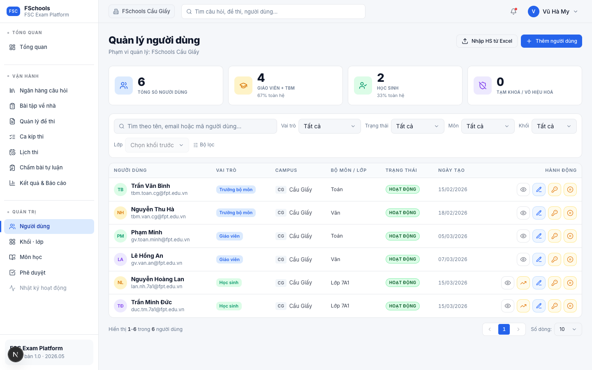

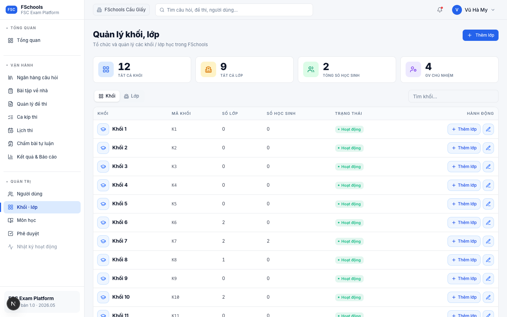

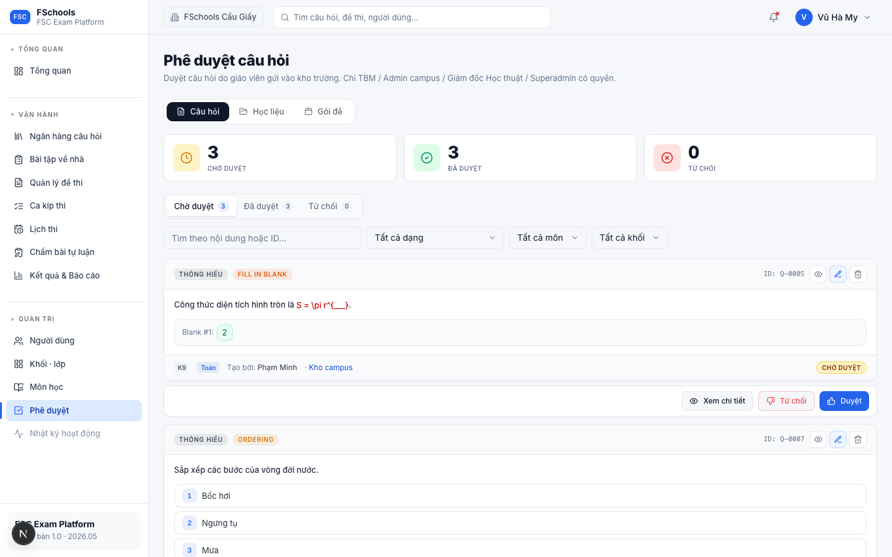

### Tạo tài khoản học sinh
1. **Người dùng → Thêm người dùng** (vai trò: Học sinh).
2. Nhập tên, mã học sinh, lớp, campus.
3. Hệ thống tạo email đăng nhập dạng `<mã-hs>@students.fsc.local`. Học sinh đăng nhập bằng **mã học sinh + mật khẩu**.

### Cấp quyền cho giáo viên
Trong hồ sơ giáo viên, bật các quyền: **Tạo khung đề**, **Tạo gói đề**, **Tạo ca thi** tuỳ nhiệm vụ.

---

## 8. Dành cho Superadmin

Superadmin chỉ thấy **Tổng quan** + **Quản lý campus**, không thao tác trực tiếp trong một campus.

- **Quản lý campus** — tạo campus mới. Khi tạo campus, hệ thống tự tạo tài khoản **quản trị campus**.
- Để vận hành bên trong một campus, **đăng nhập bằng tài khoản quản trị của campus đó**.

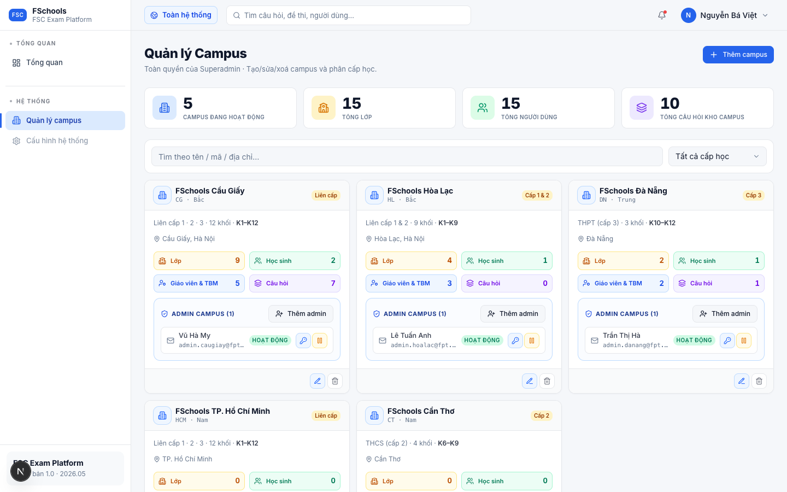

---

## 9. Câu hỏi thường gặp

**Không tạo được ca thi từ gói đề?**
→ Gói đề chưa **sinh đề**. Vào Quản lý đề thi → gói đề → **Sinh đề**, rồi quay lại tạo ca.

**Học sinh không thấy ca thi / BTVN?**
→ Kiểm tra: học sinh đã được xếp vào **đúng lớp** chưa; ca/BTVN đã **đến giờ mở** chưa; có giới hạn theo **danh sách học sinh** cụ thể không.

**Import Word bị mất công thức toán?**
→ Phải soạn công thức bằng **MathType / Equation Editor** (Insert → Equation), không gõ chữ thường. Tải lại **file mẫu** để xem ví dụ.

**Sửa câu hỏi sau khi đã tạo ca thi có ảnh hưởng học sinh không?**
→ Không. Đề được "đóng băng" khi tạo ca; học sinh thi trên bản snapshot.

**Câu tự luận đã nộp nhưng chưa có điểm?**
→ Tự luận chấm tay. Giáo viên vào **Chấm bài tự luận** để chấm theo rubric; sau đó điểm mới hiện cho học sinh.

**Quên mật khẩu?**
→ Liên hệ **quản trị campus** (mục Người dùng) để đặt lại.

---

*Tài liệu này mô tả các chức năng chính. Giao diện có thể thay đổi theo phiên bản — khi có khác biệt, ưu tiên theo nhãn hiển thị thực tế trên hệ thống.*
